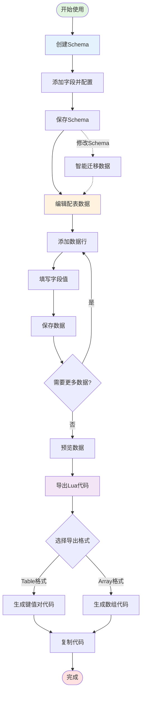
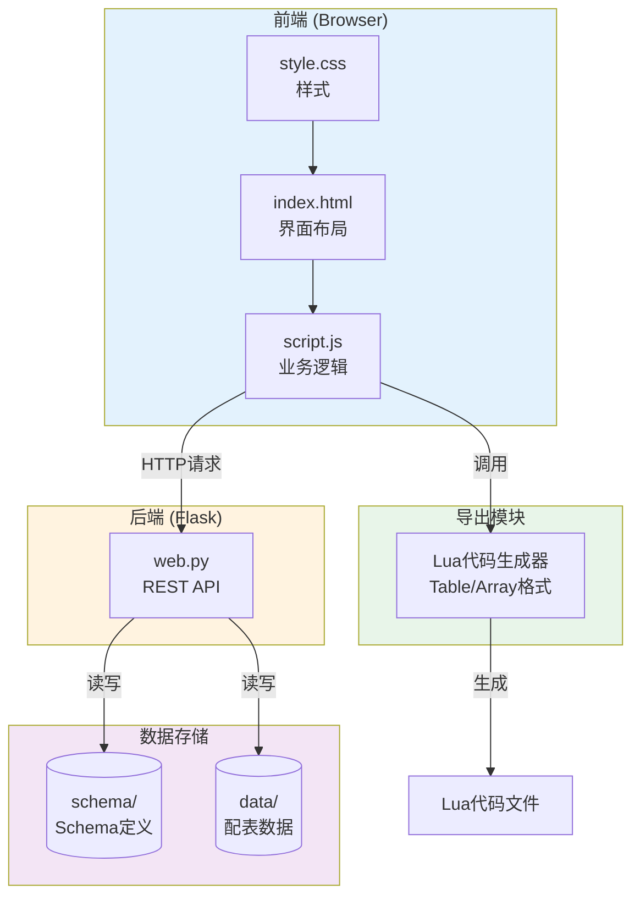

# 配表系统


一个基于Web的配表编辑工具，支持自定义Schema和可视化数据编辑，可一键导出为Lua代码。

## 功能特性

- ✅ **Schema可视化编辑**：左右分栏布局，左侧字段列表，右侧字段配置
- ✅ **多种字段类型**：文本、数字、颜色、选项、数据列表、条目（嵌套表）
- ✅ **配表数据编辑**：根据Schema自动生成编辑表单，支持动态增删数据行
- ✅ **自定义数据行名称**：每行数据可设置独立名称，导出时作为键名
- ✅ **数据联动**：支持字段选项关联其他配表（级联选择）
- ✅ **一键导出Lua**：支持Table和Array两种格式，自动生成类型注解
- ✅ **数据预览**：表格形式预览所有数据
- ✅ **智能迁移**：Schema修改后自动同步更新配表数据

## 快速开始

### 1. 安装依赖

```bash
pip install flask flask-cors
```

### 2. 启动服务

```bash
python web.py
```

服务将在 `http://localhost:5000` 启动

### 3. 打开界面

在浏览器中打开 `index.html` 文件即可使用

## 字段类型说明

| 类型 | 说明 | 适用场景 |
|------|------|----------|
| **文本 (text)** | 单行文本输入框 | 名称、描述等文本信息 |
| **数字 (number)** | 数字输入框 | 等级、权重、数量等数值 |
| **颜色 (color)** | 颜色选择器 + 文本输入 | 显示为0xRRGGBB格式，支持色盘选择 |
| **选项 (option)** | 下拉选择框 | 固定选项的枚举值 |
| **数据列表 (datalist)** | 带搜索的下拉列表 | 可输入可选择的数据 |
| **条目 (entry)** | 可动态增删的嵌套表 | 列表类数据（如奖励列表、权重池） |

### 数据源配置

选项和数据列表类型支持两种数据源：
- **手动输入**：直接在Schema中定义选项列表
- **关联配表**：从其他配表中动态加载数据（级联选择）

## 使用流程



### 步骤1：创建Schema

1. 切换到"Schema编辑"面板
2. 点击"新建Schema"按钮
3. 填写Schema名称和描述
4. 点击"添加字段"，在左侧列表中添加字段
5. 点击字段进行编辑，配置字段属性：
   - 字段名称（用于代码中的变量名）
   - 字段标签（显示在界面上的名称）
   - 字段类型（文本、数字、颜色等）
   - 默认值、是否必填等
6. 如果是条目类型，配置子字段
7. 点击"保存"按钮

### 步骤2：编辑配表数据

1. 切换到"配表编辑"面板
2. 从下拉列表选择要编辑的Schema
3. 点击"添加行"创建数据行
4. 点击左侧数据行进行编辑
5. 在右侧编辑器中填写各字段的值
6. 修改数据行名称（用于Lua导出的键名）
7. 点击"保存"按钮

### 步骤3：导出Lua代码

1. 点击"导出Lua"按钮
2. 配置导出选项：
   - 选择格式（Table/Array）
   - 设置Namespace名称
   - 添加require导入（可选）
3. 点击"复制代码"复制到剪贴板
4. 粘贴到Lua文件中使用

### 数据预览

点击"预览"按钮可以以表格形式查看所有数据

## Lua导出说明

### Table格式（键值对）

适合通过ID快速查找的场景：

```lua
---@type table<string, FishPool>
local result = {
    ["pool_1"] = {
        pool_name = "新手池",
        min_level = 1,
        fish_entries = {
            { fish_id = "FishCode.Clownfish", weight = 50 }
        }
    }
}
```

### Array格式（数组）

适合顺序遍历的场景：

```lua
---@type FishPool[]
local result = {
    {
        pool_name = "新手池",
        min_level = 1,
        fish_entries = {
            { fish_id = "FishCode.Clownfish", weight = 50 }
        }
    }
}
```

### 特性

- ✅ 自动生成LuaLS类型注解（`@class`, `@field`）
- ✅ 智能识别枚举值（包含`.`的字段值不加引号）
- ✅ 自动添加字段注释（显示字段标签）
- ✅ 颜色类型导出为`0xRRGGBB`格式
- ✅ 纯数字字段名使用`[1]`格式（不带引号）
- ✅ 支持自定义require导入和namespace

## 高级功能

### Schema智能迁移

修改Schema后保存时，系统会自动：
- 检测字段的增删改
- 显示变更详情供确认
- 智能映射重命名的字段（按顺序和类型匹配）
- 保留类型未变字段的原有数据
- 新增字段使用默认值

### 数据联动

选项/数据列表字段可以关联其他配表：
1. 配置数据源为"关联配表"
2. 选择要关联的Schema和字段
3. 编辑数据时自动加载关联表的选项

### 原始值标记

字段可以标记为"原始"（Raw），导出Lua时：
- 普通字段：`name = FishCode.Clownfish`（不加引号）
- 数据行：`[FishCode.Clownfish] = {...}`（键不加引号）

## 注意事项

- 切换数据行前会自动保存当前编辑到内存
- Schema名称只能包含字母、数字、下划线和连字符
- 删除Schema会同时删除关联的配表数据
- 数据存储在 `schema/` 和 `data/` 目录

## 项目结构

```
web/
├── index.html          # 前端界面
├── script.js           # 主要逻辑
├── style.css           # 样式文件
├── web.py             # 后端服务
├── schema/            # Schema定义（JSON）
└── data/              # 配表数据（JSON）
```

### 系统架构



---

**作者**: 豆油汉堡
