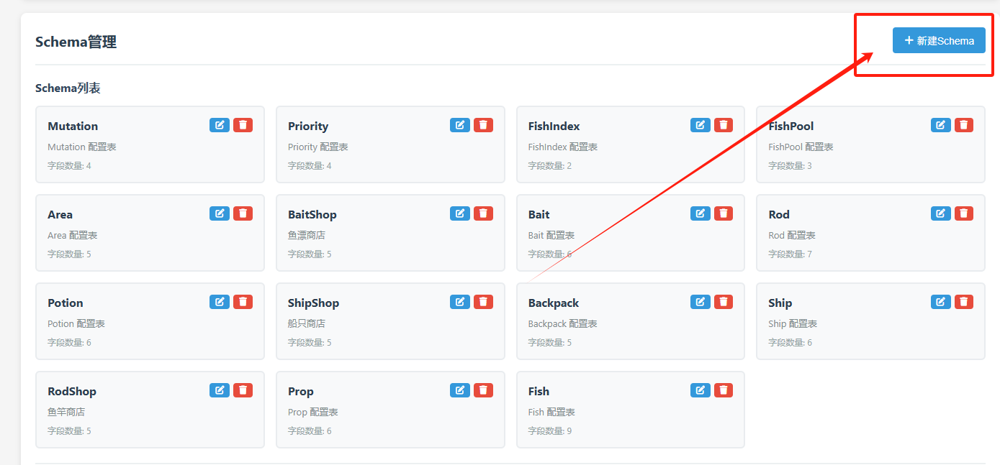
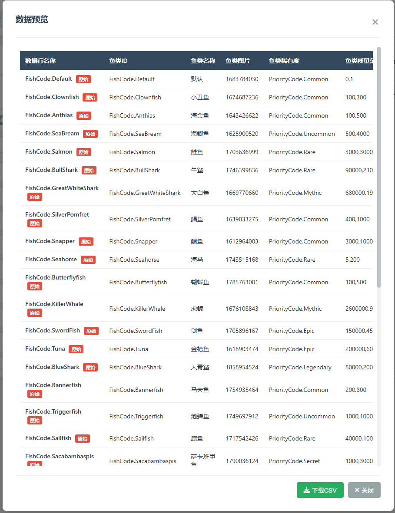
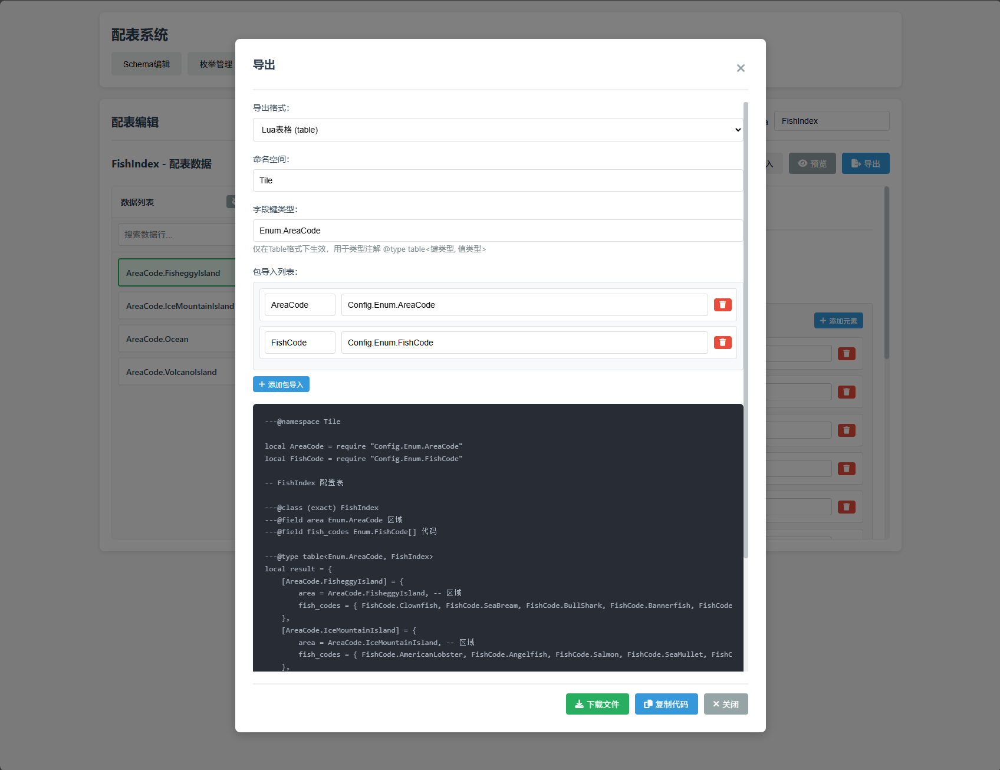

# 🎮 蛋仔配表系统

<div align="center">


**专为蛋仔派对打造的可视化配表工具**

让游戏数据配置变得简单又高效 🚀

[快速开始](#-5分钟上手) · [功能特性](#-核心功能) · [在线文档](./docs/) · [问题反馈](https://github.com/HangBack/eggy_config_system/issues)

</div>

---

## 💡 这是什么？

在蛋仔派对中制作游戏内容时，你是否遇到过这些困扰？

- ❌ **手写配置文件太繁琐**，容易出错
- ❌ **数据和代码分离**，编辑器的表格无法导出为 Lua
- ❌ **魔法数字满天飞**，代码难以维护
- ❌ **团队协作混乱**，配置格式不统一

**蛋仔配表系统**帮你解决这一切！

✅ **可视化界面** - 像填表格一样简单  
✅ **一键导出 Lua** - 自动生成代码，直接用于蛋仔派对  
✅ **枚举管理** - 告别魔法数字，代码更清晰  
✅ **本地运行** - 数据安全可控，无需联网

---

## 🎯 核心功能

<table>
  <tr>
    <td width="50%" valign="top">
      <h3>📋 Schema 配置</h3>
      <p><strong>定义数据结构，像设计表格一样</strong></p>
      <ul>
        <li>🔹 支持10+种字段类型</li>
        <li>🔹 可视化字段编辑器</li>
        <li>🔹 自动数据验证</li>
        <li>🔹 字段关联和引用</li>
      </ul>
      
    </td>
    <td width="50%" valign="top">
      <h3>🏷️ 枚举管理</h3>
      <p><strong>统一管理常量，代码更易读</strong></p>
      <ul>
        <li>🔸 数字/字符串/标志位/事件枚举</li>
        <li>🔸 跨表共享枚举值</li>
        <li>🔸 自动生成注释</li>
        <li>🔸 支持事件参数定义</li>
      </ul>
      
    </td>
  </tr>
  <tr>
    <td width="50%" valign="top">
      <h3>📝 配表编辑</h3>
      <p><strong>像Excel一样编辑游戏数据</strong></p>
      <ul>
        <li>🔹 所见即所得的编辑体验</li>
        <li>🔹 智能字段提示和搜索</li>
        <li>🔹 一键复制/删除数据行</li>
        <li>🔹 支持复杂嵌套结构</li>
      </ul>
      
    </td>
    <td width="50%" valign="top">
      <h3>📤 Lua 导出</h3>
      <p><strong>一键生成蛋仔派对可用代码</strong></p>
      <ul>
        <li>🔸 完整的类型注解</li>
        <li>🔸 规范的代码格式</li>
        <li>🔸 枚举自动引用</li>
        <li>🔸 复制即用，零修改</li>
      </ul>
      
    </td>
  </tr>
</table>

---

## ⚡ 5分钟上手

### 第一步：安装并启动

```bash
# 1️⃣ 下载项目
git clone https://github.com/HangBack/eggy_config_system.git
cd eggy_config_system

# 2️⃣ 安装依赖（仅需两个库！）
pip install -r requirements.txt

# 3️⃣ 启动服务
python web.py
```

### 第二步：打开浏览器

在浏览器输入：**`http://localhost:3001`**

看到界面就成功了！🎉

### 第三步：创建你的第一个配表

1. **点击「Schema 管理」** → 新建 Schema → 填写名称（如 `FishConfig`）
2. **添加字段** → 鱼类ID、鱼类名称、稀有度...
3. **切换到「配表编辑」** → 选择刚创建的 Schema → 新增数据
4. **点击「导出 Lua」** → 复制代码 → 粘贴到蛋仔派对项目中

✨ **完成！** 你已经掌握了核心流程！

---

## 📚 使用场景

<table>
  <tr>
    <td align="center" width="25%">
      <h3>🐟 钓鱼系统</h3>
      <p>配置鱼类属性、稀有度、掉落概率</p>
    </td>
    <td align="center" width="25%">
      <h3>🏪 商店系统</h3>
      <p>管理商品、价格、库存、折扣</p>
    </td>
    <td align="center" width="25%">
      <h3>⚔️ 技能系统</h3>
      <p>定义技能效果、冷却、等级数据</p>
    </td>
    <td align="center" width="25%">
      <h3>🗺️ 关卡配置</h3>
      <p>设置波次、敌人、奖励、难度</p>
    </td>
  </tr>
</table>

只要涉及到**游戏数据配置**，这个工具都能帮到你！

👉 查看完整案例：[使用示例](./docs/使用示例.md)

---

## 🎨 支持的字段类型

| 类型 | 说明 | 适用场景 |
|------|------|---------|
| 📝 **文本** | 字符串类型 | 名称、描述、路径 |
| 🔢 **数字** | 整数/小数 | ID、属性值、价格 |
| 🎨 **颜色** | 十六进制颜色 | UI颜色、特效颜色 |
| 📋 **选项** | 单选下拉框 | 类型、等级、状态 |
| 🔍 **数据列表** | 可搜索的选择框 | 大量选项、智能搜索 |
| 📦 **列表** | 数组类型 | 技能列表、道具列表 |
| 📚 **字典** | 复合对象 | 位置坐标、属性组 |
| 📑 **条目** | 对象数组 | 商品列表、关卡波次 |
| 🚩 **标志位** | 位运算枚举 | 权限、功能开关 |

👉 详细说明：[字段类型文档](./docs/字段类型.md)

---

## 🎓 学习资源

| 📚 文档 | 📝 说明 |
|--------|---------|
| [字段类型说明](./docs/字段类型.md) | 10+ 种字段类型详细介绍和使用方法 |
| [枚举管理指南](./docs/枚举管理.md) | 4 种枚举类型完全指南，含代码示例 |
| [配表编辑教程](./docs/配表编辑.md) | 从新建到导出的完整操作流程 |
| [使用示例](./docs/使用示例.md) | 5 个真实游戏系统的配表实战案例 |

---

## 💬 常见问题

<details>
<summary><b>🔧 安装和启动问题</b></summary>

**Q: 提示缺少 Python？**  
A: 前往 [Python 官网](https://www.python.org/downloads/) 下载安装 Python 3.7 或更高版本

**Q: 端口被占用怎么办？**  
A: 编辑 `web.py` 最后一行，将 `port=3001` 改为其他端口（如 `8080`）

**Q: 浏览器打不开？**  
A: 检查 Python 服务是否成功启动，确认命令行窗口没有报错

</details>

<details>
<summary><b>📝 使用问题</b></summary>

**Q: 修改 Schema 后，旧数据会丢失吗？**  
A: 不会！系统会智能处理：
- 新增字段 → 自动填充默认值
- 删除字段 → 自动清理旧字段
- 修改类型 → 提示手动检查

**Q: 数据保存在哪里？**  
A: 所有数据保存在项目文件夹：
- `schema/` - 表结构定义
- `data/` - 数据内容
- `enum/` - 枚举定义

**Q: 导出的 Lua 代码有错误？**  
A: 检查是否有特殊字符或格式问题，「原始文本」选项用于 Lua 代码片段

</details>

<details>
<summary><b>🤝 协作问题</b></summary>

**Q: 可以多人同时编辑吗？**  
A: 当前不支持实时协作，建议：
- 使用 Git 管理配置文件
- 约定编辑时间避免冲突
- 定期同步和合并

**Q: 如何备份数据？**  
A: 两种方式：
1. 复制 `schema/`、`data/`、`enum/` 文件夹
2. 使用「导出 JSON」功能

</details>

<details>
<summary><b>🎮 蛋仔派对集成问题</b></summary>

**Q: 导出的代码如何使用？**  
A: 直接粘贴到蛋仔项目的 Lua 文件中，使用 `require` 引入即可

**Q: 类型注解有什么用？**  
A: 提供智能代码提示，减少输入错误，提高开发效率

**Q: 枚举值怎么引用？**  
A: 使用 `Enum.枚举名.键名`，如 `Enum.FishRarity.EPIC`

</details>

---

## 🌟 为什么选择我们

<table>
  <tr>
    <td align="center">
      <h3>⚡ 简单易用</h3>
      <p>无需编程基础<br>5分钟即可上手</p>
    </td>
    <td align="center">
      <h3>🎯 专为蛋仔设计</h3>
      <p>完美支持 Lua<br>自动生成类型注解</p>
    </td>
    <td align="center">
      <h3>🔒 数据安全</h3>
      <p>本地运行<br>数据完全掌控</p>
    </td>
    <td align="center">
      <h3>🆓 完全免费</h3>
      <p>开源项目<br>永久免费使用</p>
    </td>
  </tr>
</table>

---

## 🤝 参与贡献

欢迎提交 Issue 和 Pull Request！

如果这个项目对你有帮助，请给个 ⭐ Star 支持一下！

---

## 📞 联系方式

- 📧 问题反馈：[GitHub Issues](https://github.com/HangBack/eggy_config_system/issues)
- 📖 完整文档：[./docs/](./docs/)
- 🌐 项目主页：[GitHub](https://github.com/HangBack/eggy_config_system)

---

## 📄 开源协议

本项目采用 [MIT](./LICENSE) 协议开源

```
Copyright (c) 2025 HangBack

使用、复制、修改、合并、发布、分发、再授权和/或出售本软件副本，均无限制。
```

---

<div align="center">

**🎮 让配表变得简单，让游戏开发更高效！**

Made with ❤️ for 蛋仔派对开发者

</div>