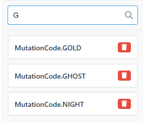
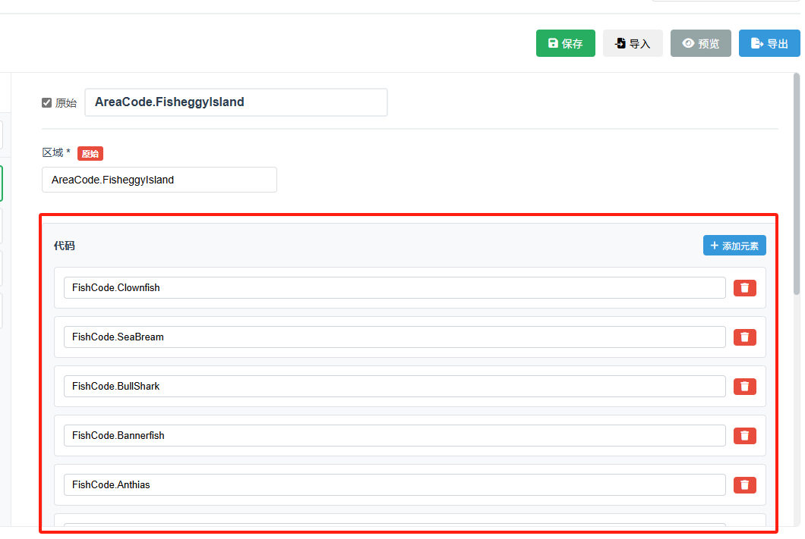
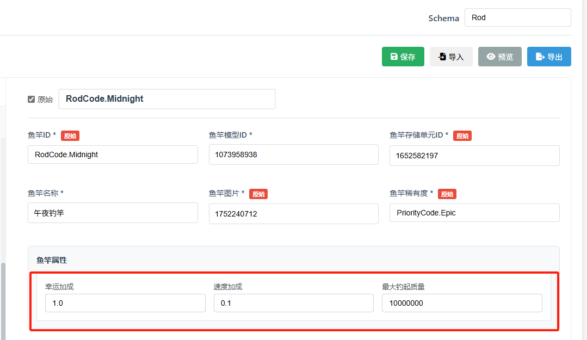

# 字段类型说明

本文档详细介绍了配表系统支持的所有字段类型及其使用方法。

## 📑 目录

- [基础类型](#基础类型)
  - [文本 (text)](#文本-text)
  - [数字 (number)](#数字-number)
  - [颜色 (color)](#颜色-color)
- [选择类型](#选择类型)
  - [选项 (option)](#选项-option)
  - [数据列表 (datalist)](#数据列表-datalist)
- [复杂类型](#复杂类型)
  - [列表 (list)](#列表-list)
  - [字典 (dict)](#字典-dict)
  - [条目 (entry)](#条目-entry)
  - [标志位 (flags)](#标志位-flags)

---

## 基础类型

### 文本 (text)

**用途**：存储文本字符串

**配置项**：
- 默认值：初始文本内容
- 原始文本：勾选后导出 Lua 时保持原始格式（不加引号）

**使用场景**：
- 角色名称、物品描述
- 文件路径、资源ID
- 配置说明文字

**示例**：
```lua
-- 普通文本
fish_name = "草鱼"

-- 原始文本（用于 Lua 代码或特殊标识）
callback_func = DoSomething
```

**注意事项**：
- 普通文本会自动添加引号
- 原始文本不会添加引号，常用于函数名、枚举值等

---

### 数字 (number)

**用途**：存储数值

**配置项**：
- 默认值：初始数字
- Lua 注解类型：可指定 `integer`（整数）或 `number`（浮点数）

**使用场景**：
- 数值配置：生命值、攻击力、价格
- ID 标识：物品ID、关卡ID
- 比例系数：倍率、概率（0-1）

**示例**：
```lua
fish_id = 1001
base_weight = 2.5
drop_rate = 0.15
```

**注意事项**：
- 支持整数和小数
- 可以为负数
- 不要用引号包裹数字

---

### 颜色 (color)

**用途**：存储颜色值

**配置项**：
- 默认值：十六进制颜色代码（如 `#FF0000`）

**使用场景**：
- UI 颜色配置
- 特效颜色
- 稀有度颜色标识

**示例**：
```lua
rarity_color = "#FFD700"  -- 金色
highlight_color = "#FF4500"  -- 橙红色
```

**编辑界面**：
- 提供颜色选择器
- 可手动输入十六进制代码
- 实时预览颜色效果

---

## 选择类型

### 选项 (option)

**用途**：从固定选项中选择一个值

**数据源类型**：

#### 1. 手动配置
直接在 Schema 中定义选项列表

**配置方式**：
- 点击「手动配置选项」
- 添加选项，每个选项包含：
  - **值**：实际保存的值
  - **标签**：显示给用户的文字

**示例配置**：
```
值: 1, 标签: 普通
值: 2, 标签: 稀有
值: 3, 标签: 史诗
```

**使用场景**：
- 选项固定且数量少
- 不需要跨表复用

#### 2. 关联表
引用其他 Schema 的数据作为选项

**配置方式**：
- 选择数据源类型为「关联表」
- 选择目标 Schema
- 选择用作值的字段
- 选择用作标签的字段

**使用场景**：
- 关联其他配表（如选择物品、角色）
- 数据需要统一管理

**示例**：
```
关联表: ItemConfig
值字段: item_id
标签字段: item_name
```

#### 3. 关联枚举
引用枚举作为选项

**配置方式**：
- 选择数据源类型为「关联枚举」
- 选择目标枚举

**使用场景**：
- 使用已定义的枚举值
- 保持代码可读性

**导出效果**：
```lua
fish_rarity = Enum.FishRarity.RARE  -- 使用枚举
```

---

### 数据列表 (datalist)

**用途**：类似选项，但支持输入和模糊搜索



**与选项的区别**：
- 支持直接输入值（不限于列表）
- 支持模糊搜索过滤
- 更灵活的输入方式

**数据源配置**：与选项类型相同（手动配置、关联表、关联枚举）

**使用场景**：
- 选项数量很多时
- 需要快速搜索定位
- 允许输入列表外的值

**操作方式**：
- 点击输入框展开下拉列表
- 输入关键字进行过滤
- 点击选项或直接输入值
- 支持键盘方向键选择

---

## 复杂类型

### 列表 (list)

**用途**：存储同类型元素的数组



**配置项**：
- **元素类型**：列表中每个元素的类型
  - 文本
  - 数字
  - 选项
  - 数据列表
  - 字典

**元素类型为选项/数据列表时**：
- 需要配置元素的数据源
- 支持关联表、关联枚举

**使用场景**：
- 技能列表
- 奖励列表
- 标签数组

**示例**：
```lua
-- 数字列表
drop_items = {1001, 1002, 1003}

-- 字典列表
rewards = {
    {item_id = 1, count = 10},
    {item_id = 2, count = 5}
}
```

**编辑界面**：
- 点击「添加」按钮添加元素
- 可调整元素顺序
- 可删除单个元素

---

### 字典 (dict)

**用途**：存储包含多个字段的复合对象



**配置项**：
- **子字段**：字典包含的字段列表
  - 每个子字段有自己的类型和配置
  - 子字段支持所有字段类型（包括嵌套字典）

**使用场景**：
- 复合属性（位置坐标、旋转角度）
- 配置组（音效配置、特效配置）
- 嵌套对象

**示例**：
```lua
-- 简单字典
position = {
    x = 100,
    y = 200,
    z = 0
}

-- 复杂字典（含列表）
effect_config = {
    effect_id = "explosion",
    duration = 2.5,
    colors = {"#FF0000", "#FFA500"}
}
```

**编辑界面**：
- 展开字典后显示所有子字段
- 每个子字段独立编辑
- 支持嵌套结构

---

### 条目 (entry)

**用途**：存储多个相同结构的对象（字典列表的便捷形式）

**配置项**：
- **子字段**：每个条目的字段定义

**与列表+字典的区别**：
- 条目 = 列表<字典>（专门优化的组合类型）
- 更清晰的编辑界面
- 适合表格形式的数据

**使用场景**：
- 关卡配置（多个波次）
- 商店配置（多个商品）
- 任务配置（多个目标）

**示例**：
```lua
shop_items = {
    {item_id = 1, price = 100, stock = 10},
    {item_id = 2, price = 200, stock = 5},
    {item_id = 3, price = 500, stock = 1}
}
```

**编辑界面**：
- 类似表格的编辑方式
- 每行一个条目
- 快速添加/删除行

---

### 标志位 (flags)

**用途**：使用位运算存储多个布尔值

**配置项**：
- **关联枚举**：必须选择一个标志位类型的枚举

**使用场景**：
- 权限配置
- 特性开关
- 状态标记

**枚举定义示例**：
```lua
-- 标志位枚举
FilePermission = {
    READ = 1 << 0,    -- 1
    WRITE = 1 << 1,   -- 2
    EXECUTE = 1 << 2  -- 4
}
```

**配置界面**：
- 显示枚举中的所有标志位
- 复选框形式勾选
- 自动计算组合值

**导出效果**：
```lua
-- 勾选了 READ 和 WRITE
permission = 3  -- (1 + 2)

-- 或使用位运算表达式
permission = Enum.FilePermission.READ | Enum.FilePermission.WRITE
```

---

## Lua 注解类型

所有字段都支持配置 **Lua 注解类型**，用于生成更准确的类型提示。

**常用注解类型**：
- `string` - 字符串
- `number` - 数字
- `integer` - 整数
- `boolean` - 布尔值
- `table` - 表
- `function` - 函数
- `any` - 任意类型

**自定义类型**：
系统会自动读取 `enum.lua` 中定义的 ValueType，支持蛋仔派对的所有内置类型。

**数组类型**：
使用 `类型[]` 表示数组，如 `string[]`、`number[]`

**导出示例**：
```lua
---@class Config.FishConfig
---@field fish_id integer 鱼类ID
---@field fish_name string 鱼类名称
---@field base_weight number 基础重量
---@field skills integer[] 技能列表
---@field position Vector3 位置坐标
```

---

## 字段类型选择指南

| 需求 | 推荐类型 | 说明 |
|------|---------|------|
| 简单文本 | text | 名称、描述 |
| 数值 | number | ID、属性值 |
| 固定选项（少量） | option - 手动配置 | 稀有度、类型 |
| 固定选项（大量） | datalist - 手动配置 | 支持搜索 |
| 引用其他表 | option/datalist - 关联表 | 外键关联 |
| 使用枚举 | option/datalist - 关联枚举 | 代码可读性 |
| 同类型数组 | list | 多个ID、多个值 |
| 复合对象 | dict | 位置、配置组 |
| 多个相同对象 | entry | 商品列表、任务列表 |
| 位标志 | flags | 权限、开关 |

---

## 高级用法

### 嵌套结构

字段类型支持任意嵌套：

```lua
-- 列表<字典>
characters = {
    {
        name = "角色A",
        attributes = {strength = 10, agility = 8}
    }
}

-- 字典<列表>
quest_config = {
    objectives = {1, 2, 3},
    rewards = {
        {item_id = 1, count = 10}
    }
}
```

### 类型组合建议

**简单配置**：
- 使用基础类型 + 选项

**中等复杂度**：
- 使用字典组织相关字段
- 使用列表存储多个值

**高复杂度**：
- 使用条目类型
- 嵌套字典和列表
- 合理使用枚举提高可读性

---

## 常见问题

### 1. 什么时候用选项，什么时候用数据列表？

- **选项数量 < 10**：推荐用选项
- **选项数量 > 10**：推荐用数据列表（支持搜索）
- **需要自由输入**：必须用数据列表

### 2. 列表和条目有什么区别？

- **列表**：元素可以是任意类型（包括简单类型）
- **条目**：专门用于存储多个相同结构的对象（相当于列表<字典>）

### 3. 字典和条目如何选择？

- **单个对象**：用字典
- **多个相同对象**：用条目

### 4. 如何实现多对多关系？

使用列表类型，元素类型选择 option/datalist，数据源选择关联表。

示例：角色的多个技能
```lua
character_skills = {1001, 1002, 1003}  -- 技能ID列表
```

### 5. 原始文本什么时候用？

- 字段值是 Lua 代码（函数名、变量名）
- 字段值是枚举值（不想加引号）
- 特殊格式的字符串

---

## 最佳实践

1. **合理命名**：字段名使用英文下划线命名法（`field_name`）
2. **添加注释**：字段标签用中文说明含义
3. **类型注解**：为重要字段配置 Lua 注解类型
4. **枚举优先**：能用枚举的地方尽量用枚举
5. **避免过度嵌套**：嵌套层级不超过 3 层
6. **数据归一化**：相关数据建立关联而不是重复定义

---

返回 [主文档](../README.md)
