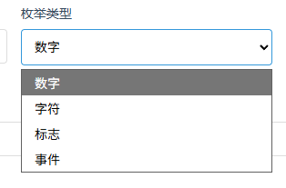
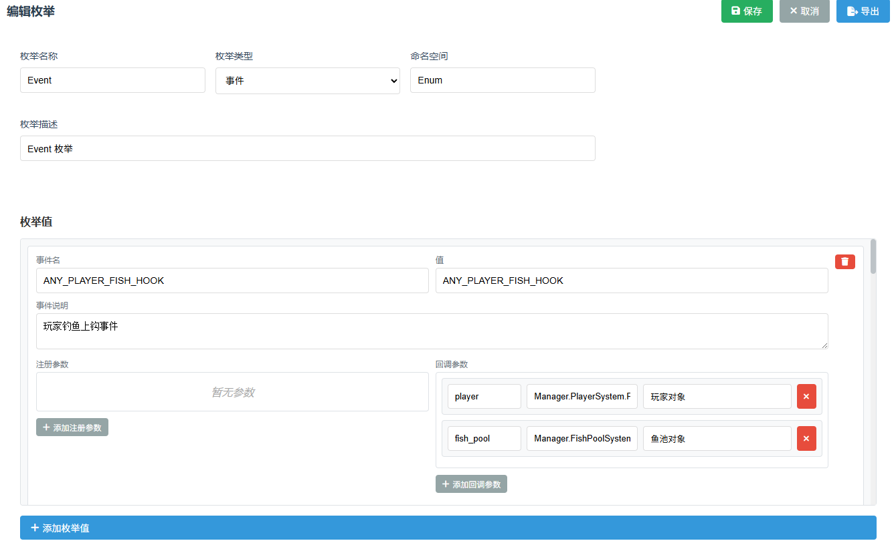

# 枚举管理指南

枚举是配表系统的重要组成部分，通过枚举可以用有意义的名称代替魔法数字，提高代码可读性和可维护性。

## 📑 目录

- [什么是枚举](#什么是枚举)
- [枚举类型](#枚举类型)
  - [数字枚举](#数字枚举)
  - [字符串枚举](#字符串枚举)
  - [标志位枚举](#标志位枚举)
  - [事件枚举](#事件枚举)
- [创建和管理枚举](#创建和管理枚举)
- [在配表中使用枚举](#在配表中使用枚举)
- [导出 Lua 代码](#导出-lua-代码)
- [最佳实践](#最佳实践)

---

## 什么是枚举

枚举（Enumeration）是一组命名常量的集合。在配表中使用枚举可以：

- **提高可读性**：用 `COMMON` 代替 `1`，代码更易理解
- **减少错误**：统一管理常量，避免魔法数字
- **便于维护**：修改枚举值，所有引用自动更新
- **跨表关联**：多个配表共享同一套枚举

**示例对比**：

```lua
-- 不使用枚举（难以理解）
fish_rarity = 3

-- 使用枚举（清晰明了）
fish_rarity = Enum.FishRarity.EPIC
```

---

## 枚举类型



系统支持四种枚举类型，适用于不同场景。

### 数字枚举

**用途**：最常见的枚举类型，值为数字

**配置**：
- 枚举名称：如 `FishRarity`
- 命名空间：默认 `Enum`
- 枚举值：键名 + 数字值 + 注释

**使用场景**：
- 稀有度等级（1=普通, 2=稀有, 3=史诗）
- 物品类型（1=武器, 2=防具, 3=消耗品）
- 游戏状态（1=准备, 2=进行中, 3=结束）

**示例**：

创建枚举：
```
枚举名: FishRarity
类型: 数字枚举

枚举值:
COMMON = 1      -- 普通
RARE = 2        -- 稀有  
EPIC = 3        -- 史诗
LEGENDARY = 4   -- 传说
```

导出 Lua 代码：
```lua
---@enum FishRarity
local FishRarity = {
    COMMON = 1,      -- 普通
    RARE = 2,        -- 稀有
    EPIC = 3,        -- 史诗
    LEGENDARY = 4,   -- 传说
}

Enum.FishRarity = FishRarity
return FishRarity
```

---

### 字符串枚举

**用途**：值为字符串类型的枚举

**配置**：
- 值类型：字符串
- 键名和值可以不同

**使用场景**：
- 资源类型标识（`"texture"`, `"audio"`, `"model"`）
- 角色职业（`"warrior"`, `"mage"`, `"archer"`）
- 场景名称（`"menu"`, `"game"`, `"shop"`）

**示例**：

创建枚举：
```
枚举名: TerrainType
类型: 字符串枚举

枚举值:
GRASS = "grass"         -- 草地
WATER = "water"         -- 水域
MOUNTAIN = "mountain"   -- 山地
DESERT = "desert"       -- 沙漠
```

导出 Lua 代码：
```lua
---@enum TerrainType
local TerrainType = {
    GRASS = "grass",         -- 草地
    WATER = "water",         -- 水域
    MOUNTAIN = "mountain",   -- 山地
    DESERT = "desert",       -- 沙漠
}

Enum.TerrainType = TerrainType
return TerrainType
```

---

### 标志位枚举

**用途**：使用位运算存储多个状态，节省空间

**配置**：
- 值使用位移运算（1<<0, 1<<1, 1<<2...）
- 可以组合多个标志位

**使用场景**：
- 权限系统（读、写、执行）
- 功能开关（多个功能的启用状态）
- 实体属性（可移动、可攻击、可交互）

**示例**：

创建枚举：
```
枚举名: FilePermission
类型: 标志位枚举

枚举值:
READ = 1        -- 读取权限 (1 << 0)
WRITE = 2       -- 写入权限 (1 << 1)
EXECUTE = 4     -- 执行权限 (1 << 2)
DELETE = 8      -- 删除权限 (1 << 3)
```

导出 Lua 代码：
```lua
---@enum FilePermission
local FilePermission = {
    READ = 1,        -- 读取权限
    WRITE = 2,       -- 写入权限
    EXECUTE = 4,     -- 执行权限
    DELETE = 8,      -- 删除权限
}

Enum.FilePermission = FilePermission
return FilePermission
```

**位运算使用**：
```lua
-- 组合多个权限
permission = FilePermission.READ | FilePermission.WRITE  -- 3

-- 检查是否有某个权限
if (permission & FilePermission.READ) ~= 0 then
    print("有读取权限")
end

-- 添加权限
permission = permission | FilePermission.EXECUTE

-- 移除权限
permission = permission & (~FilePermission.WRITE)
```

---

### 事件枚举

**用途**：定义事件名称及其注册和回调参数



**配置**：
- 事件名称：字符串类型
- 注册参数：事件注册时需要传入的参数列表
- 回调参数：事件触发时返回的数据列表

**使用场景**：
- 游戏事件系统
- UI 事件管理
- 网络消息定义

**示例**：

创建枚举：
```
枚举名: GameEvent
类型: 事件枚举

枚举值:
PLAYER_DAMAGE = "OnPlayerDamage"
  注册参数:
    - playerId (integer) 玩家ID
  回调参数:
    - damage (number) 伤害值
    - attackerId (integer) 攻击者ID
    - damageType (string) 伤害类型

ITEM_COLLECTED = "OnItemCollected"
  注册参数:
    - itemId (integer) 物品ID
  回调参数:
    - count (integer) 数量
    - position (Vector3) 拾取位置
```

导出 Lua 代码：
```lua
---@enum GameEvent
local GameEvent = {
    -- OnPlayerDamage
    -- 注册参数: playerId: integer - 玩家ID
    -- 回调参数: damage: number - 伤害值, attackerId: integer - 攻击者ID, damageType: string - 伤害类型
    PLAYER_DAMAGE = "OnPlayerDamage",
    
    -- OnItemCollected
    -- 注册参数: itemId: integer - 物品ID
    -- 回调参数: count: integer - 数量, position: Vector3 - 拾取位置
    ITEM_COLLECTED = "OnItemCollected",
}

Enum.GameEvent = GameEvent
return GameEvent
```

**事件使用示例**：
```lua
-- 注册事件
EventSystem:Register(GameEvent.PLAYER_DAMAGE, playerId, function(damage, attackerId, damageType)
    print(string.format("玩家受到 %d 点伤害，来自 %d", damage, attackerId))
end)

-- 触发事件
EventSystem:Trigger(GameEvent.PLAYER_DAMAGE, playerId, 50, enemyId, "physical")
```

---

## 创建和管理枚举

### 创建新枚举

1. 切换到「**枚举管理**」标签
2. 点击「**新建枚举**」按钮
3. 填写基本信息：
   - **名称**：枚举的名称（如 `FishRarity`）
   - **类型**：选择枚举类型
   - **命名空间**：Lua 命名空间（默认 `Enum`）
   - **描述**：枚举的说明

### 添加枚举值

根据枚举类型，配置界面略有不同：

**数字/字符串/标志位枚举**：
- 点击底部「**添加枚举值**」按钮
- 填写键名、值、注释
- 保存

**事件枚举**：
- 点击底部「**添加枚举值**」按钮
- 填写键名、事件名称、注释
- 配置注册参数：
  - 点击「添加注册参数」
  - 填写参数名、类型、描述
- 配置回调参数：
  - 点击「添加回调参数」
  - 填写参数名、类型、描述

### 编辑枚举

1. 在左侧枚举列表中选择要编辑的枚举
2. 在右侧编辑器中修改
3. 点击「**保存枚举**」

### 删除枚举

1. 选择要删除的枚举
2. 点击「**删除枚举**」按钮
3. 确认删除

> ⚠️ **注意**：删除枚举前，请确保没有配表正在使用该枚举，否则可能导致数据错误。

---

## 在配表中使用枚举

### 选项字段使用枚举

1. 在 Schema 编辑器中，添加字段
2. 字段类型选择「**选项**」或「**数据列表**」
3. 数据源类型选择「**关联枚举**」
4. 选择目标枚举

### 标志位字段使用枚举

1. 字段类型选择「**标志位**」
2. 关联枚举选择标志位类型的枚举
3. 在数据编辑时，通过复选框勾选多个标志位

### 导出效果

配表中使用枚举的字段，导出时会生成枚举引用：

```lua
-- 选项字段
fish_config = {
    fish_id = 1,
    rarity = Enum.FishRarity.EPIC,  -- 枚举引用
}

-- 标志位字段
file_config = {
    permission = 3,  -- READ | WRITE
}
```

---

## 导出 Lua 代码

### 预览枚举

1. 选择要查看的枚举
2. 右侧自动显示预览

**预览内容包括**：
- 枚举类型
- 命名空间
- 所有枚举值
- 对于事件枚举，显示参数详情

### 导出单个枚举

1. 选择枚举
2. 点击「**导出 Lua**」按钮
3. 点击「**复制**」按钮
4. 粘贴到 Lua 文件中

### 批量导出

如果有多个枚举，建议：

1. 创建一个 `Enums.lua` 文件
2. 依次导出所有枚举
3. 合并到同一个文件中
4. 在其他模块中 `require("Enums")`

**Enums.lua 示例**：
```lua
-- Enums.lua
local Enum = {}

-- FishRarity 枚举
---@enum FishRarity
local FishRarity = {
    COMMON = 1,
    RARE = 2,
    EPIC = 3,
    LEGENDARY = 4,
}
Enum.FishRarity = FishRarity

-- TerrainType 枚举
---@enum TerrainType
local TerrainType = {
    GRASS = "grass",
    WATER = "water",
    MOUNTAIN = "mountain",
}
Enum.TerrainType = TerrainType

return Enum
```

---

## 最佳实践

### 命名规范

**枚举名称**：
- 使用 PascalCase（大驼峰）
- 名词单数或复数形式
- 例如：`FishRarity`、`ItemType`、`GameState`

**枚举键名**：
- 全大写，单词间用下划线
- 例如：`COMMON`、`VERY_RARE`、`PLAYER_DIED`

**命名空间**：
- 建议统一使用 `Enum`
- 避免与游戏其他模块冲突

### 枚举值分配

**数字枚举**：
- 从 1 开始（Lua 表索引习惯）
- 连续分配，便于遍历
- 预留空间用于后续扩展

**字符串枚举**：
- 使用小写下划线命名
- 保持简短且有意义
- 避免特殊字符

**标志位枚举**：
- 使用 2 的幂次（1, 2, 4, 8, 16...）
- 最多支持 32 个标志位（受限于 Lua number）
- 按重要性和使用频率排序

### 何时使用枚举

**应该使用枚举**：
- ✅ 固定的常量集合
- ✅ 需要在多处引用
- ✅ 值有特定含义
- ✅ 需要类型检查

**不建议使用枚举**：
- ❌ 值会频繁变动
- ❌ 只在一个地方使用
- ❌ 值没有明确含义
- ❌ 数量非常大（>50个）

### 枚举的维护

**添加新值**：
- 追加到末尾，不要插入中间
- 保持值的连续性（数字枚举）

**修改枚举值**：
- ⚠️ 谨慎修改已有值，可能影响旧数据
- 建议添加新值，逐步迁移

**删除枚举值**：
- ⚠️ 删除前检查是否有配表引用
- 建议标记为废弃，而不是直接删除

---

## 常见问题

### 1. 数字枚举和字符串枚举如何选择？

- **数字枚举**：节省空间，适合内部使用
- **字符串枚举**：可读性强，适合日志、调试、与外部系统交互

### 2. 标志位最多支持多少个？

Lua 的 number 类型使用双精度浮点数，整数部分最多 53 位。实际使用中建议不超过 32 个标志位。

### 3. 事件枚举的参数类型从哪里来？

参数类型可以：
- 手动输入（如 `integer`、`string`）
- 选择蛋仔内置类型（系统会读取 `enum.lua`）
- 使用自定义类型（如配表中定义的类）

### 4. 可以修改已有枚举的值吗？

可以，但要注意：
- 已保存的配表数据不会自动更新
- 需要手动检查并更新受影响的数据
- 建议在开发早期确定枚举值

### 5. 枚举可以继承或扩展吗？

当前版本不支持枚举继承。如需扩展，可以：
- 创建新枚举
- 或在原枚举中添加新值

---

## 进阶技巧

### 枚举组合使用

多个枚举配合使用，提高配置灵活性：

```lua
-- 物品配置
item_config = {
    item_id = 1,
    item_type = Enum.ItemType.WEAPON,      -- 物品类型枚举
    rarity = Enum.ItemRarity.EPIC,         -- 稀有度枚举
    element = Enum.ElementType.FIRE,       -- 元素类型枚举
}
```

### 枚举转换函数

在 Lua 中添加辅助函数，增强枚举功能：

```lua
-- 根据值查找键名
function Enum.GetKeyByValue(enumTable, value)
    for k, v in pairs(enumTable) do
        if v == value then
            return k
        end
    end
    return nil
end

-- 使用
local rarityName = Enum.GetKeyByValue(Enum.FishRarity, 3)
print(rarityName)  -- "EPIC"
```

### 枚举验证

添加验证函数，确保值有效：

```lua
function Enum.IsValid(enumTable, value)
    for _, v in pairs(enumTable) do
        if v == value then
            return true
        end
    end
    return false
end

-- 使用
if not Enum.IsValid(Enum.FishRarity, rarity) then
    error("无效的稀有度: " .. tostring(rarity))
end
```

---

返回 [主文档](../README.md) | [字段类型](./字段类型.md)
