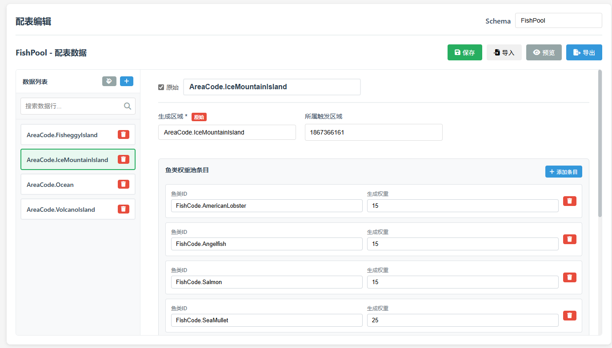

# 配表编辑教程

本教程详细介绍如何使用配表编辑功能，创建和管理游戏数据。

## 📑 目录

- [开始使用](#开始使用)
- [基本操作](#基本操作)
  - [选择 Schema](#选择-schema)
  - [新增数据](#新增数据)
  - [编辑数据](#编辑数据)
  - [删除数据](#删除数据)
  - [复制数据](#复制数据)
- [不同字段类型的编辑](#不同字段类型的编辑)
- [数据导入导出](#数据导入导出)
- [Schema 变更处理](#schema-变更处理)
- [完整示例](#完整示例)
- [技巧与建议](#技巧与建议)

---

## 开始使用

配表编辑是基于 Schema 定义的可视化数据编辑功能。在开始编辑数据前，请确保：

1. ✅ 已创建对应的 Schema
2. ✅ Schema 中的字段定义完整
3. ✅ 需要的枚举已创建

---

## 基本操作

### 选择 Schema

1. 点击顶部标签切换到「**配表编辑**」
2. 在顶部下拉框中选择要编辑的 Schema
3. 系统会加载该 Schema 的所有数据


> 💡 **提示**：下拉框支持模糊搜索，输入关键字快速定位 Schema

---

### 新增数据

**方法一：使用新增按钮**

1. 点击左上角「**新增数据**」按钮
2. 右侧编辑器会显示所有字段（使用默认值）
3. 填写各个字段的值
4. 点击「**保存**」按钮

**方法二：复制已有数据（推荐）**

1. 点击某一行右侧的「**复制**」按钮
2. 系统会复制该行的所有数据
3. 修改需要变更的字段
4. 点击「**保存**」按钮

> 💡 **提示**：复制数据可以快速创建相似的配置，提高效率

---

### 编辑数据

1. 在左侧数据列表中点击要编辑的行
2. 右侧编辑器会显示该行的所有数据
3. 修改字段值
4. 点击「**保存**」按钮

**修改会自动保存到文件**，无需担心数据丢失。

---

### 删除数据

1. 找到要删除的数据行
2. 点击行右侧的「**删除**」按钮
3. 确认删除

> ⚠️ **警告**：删除操作不可恢复，请谨慎操作。建议删除前先导出备份。

---

### 复制数据

复制功能可以快速创建相似数据：

1. 点击某一行的「**复制**」按钮
2. 系统会创建一个新数据，内容与原数据相同
3. 修改需要变更的字段（如 ID）
4. 保存

**适用场景**：
- 创建同系列的物品（只改 ID 和名称）
- 创建难度递增的关卡（只改数值）
- 批量配置相似的 NPC

---

## 不同字段类型的编辑

### 文本字段

直接在输入框中输入文本。


**提示**：
- 支持多行文本（按回车换行）
- 如果字段标记为「原始文本」，输入的内容会原样导出

---

### 数字字段

输入数字，支持整数和小数。


**提示**：
- 可以使用上下箭头微调
- 支持负数
- 小数点后精度由输入决定

---

### 颜色字段

点击颜色框打开颜色选择器，或直接输入十六进制颜色代码。


**提示**：
- 支持的格式：`#RRGGBB`
- 可以实时预览颜色效果

---

### 选项字段

从下拉列表中选择一个选项。


**数据源类型**：
- **手动配置**：显示预定义的选项
- **关联表**：显示其他 Schema 的数据
- **关联枚举**：显示枚举值

---

### 数据列表字段

类似选项字段，但支持输入和搜索。


**操作方式**：
1. 点击输入框展开下拉列表
2. 直接输入关键字进行过滤
3. 点击选项或手动输入值
4. 支持键盘方向键选择

**适用场景**：
- 选项数量很多（>10个）
- 需要快速搜索定位
- 允许输入列表外的值

---

### 列表字段

存储多个相同类型的值。


**操作步骤**：
1. 点击「**添加**」按钮
2. 在弹出的输入框中输入值
3. 重复添加多个元素
4. 点击元素右侧的「❌」删除

**拖动排序**：
- 按住元素可以拖动
- 调整元素顺序

---

### 字典字段

编辑包含多个子字段的复合对象。


**操作步骤**：
1. 点击字典字段展开
2. 编辑各个子字段
3. 子字段可以是任意类型（包括嵌套字典）

**示例**：位置坐标字典
```
position (字典)
├─ x (数字): 100
├─ y (数字): 200
└─ z (数字): 0
```

---

### 条目字段

编辑多个相同结构的对象。



**操作步骤**：
1. 点击「**添加条目**」按钮
2. 展开条目，编辑各个子字段
3. 点击「❌」删除条目
4. 拖动调整条目顺序

**示例**：商店物品列表
```
shop_items (条目)
├─ 条目 1
│  ├─ item_id: 1001
│  ├─ price: 100
│  └─ stock: 10
├─ 条目 2
│  ├─ item_id: 1002
│  ├─ price: 200
│  └─ stock: 5
```

---

### 标志位字段

使用复选框选择多个标志位。


**操作步骤**：
1. 勾选需要的标志位（可多选）
2. 系统自动计算组合值
3. 保存

**示例**：文件权限
```
☑ READ (1)
☑ WRITE (2)
☐ EXECUTE (4)
☐ DELETE (8)

最终值：3 (READ | WRITE)
```

---

## 数据导入导出

### 导出为 Lua 代码

1. 在配表编辑界面，点击「**导出 Lua**」按钮
2. 系统生成带类型注解的 Lua 代码
3. 点击「**复制**」按钮
4. 粘贴到 Lua 文件中使用

**导出内容包括**：
- 类型注解（`---@class`、`---@field`）
- 数据表
- 命名空间赋值

**示例输出**：
```lua
---@class Config.FishConfig
---@field fish_id integer 鱼类ID
---@field fish_name string 鱼类名称
---@field rarity number 稀有度

---@type Config.FishConfig[]
local FishConfig = {
    { fish_id = 1, fish_name = "草鱼", rarity = 1 },
    { fish_id = 2, fish_name = "鲤鱼", rarity = 2 },
}

Config.FishConfig = FishConfig
return FishConfig
```

---

### 导出为 JSON

1. 点击「**导出 JSON**」按钮
2. 选择保存位置
3. 文件保存为 `.json` 格式

**用途**：
- 数据备份
- 数据迁移
- 与其他工具交互

---

### 导入 JSON

1. 点击「**导入 JSON**」按钮
2. 选择要导入的 JSON 文件
3. 系统会解析并加载数据

> ⚠️ **注意**：导入会覆盖当前数据，建议先备份

---

## Schema 变更处理

当 Schema 定义发生变化时，系统会智能处理数据迁移。

### 新增字段

**情况**：Schema 添加了新字段

**处理**：
- 系统会提示有新字段
- 旧数据会自动填充默认值
- 手动编辑每条数据，补充新字段的值

**示例**：
```
Schema 新增字段: element_type (元素类型)
旧数据自动添加: element_type = 1 (默认值)
```

---

### 删除字段

**情况**：Schema 删除了某个字段

**处理**：
- 系统会提示有字段被移除
- 旧数据中的该字段会被自动删除
- 不需要手动操作

**示例**：
```
Schema 删除字段: old_field
旧数据自动移除: old_field 字段被删除
```

---

### 修改字段类型

**情况**：Schema 修改了字段类型

**处理**：
- 系统会提示字段类型变更
- 需要手动检查数据兼容性
- 根据新类型调整数据值

**常见类型转换**：
- 数字 → 文本：自动转换
- 文本 → 数字：需手动调整，确保值为有效数字
- 选项 → 数据列表：兼容
- 简单类型 → 复杂类型：需重新配置

> 💡 **建议**：重大类型变更前，先导出备份

---

### 字段重命名

**情况**：Schema 字段名称改变

**处理**：
- 系统视为删除旧字段 + 添加新字段
- 数据不会自动迁移
- 需要手动将旧字段的值复制到新字段

**建议流程**：
1. 导出当前数据为 JSON
2. 修改 Schema 字段名
3. 使用脚本或手动编辑 JSON，重命名字段
4. 重新导入 JSON

---

## 完整示例

### 示例：创建钓鱼游戏配置

#### 第一步：准备工作

创建枚举：
- `FishRarity`（鱼类稀有度）：COMMON=1, RARE=2, EPIC=3
- `FishHabitat`（鱼类栖息地）：RIVER="river", LAKE="lake", OCEAN="ocean"

创建 Schema：
- `FishConfig`（鱼类配置）
  - fish_id (数字) - 鱼类ID
  - fish_name (文本) - 鱼类名称
  - rarity (选项 - 关联枚举 FishRarity) - 稀有度
  - habitat (选项 - 关联枚举 FishHabitat) - 栖息地
  - base_weight (数字) - 基础重量（kg）
  - price (数字) - 售价
  - attributes (字典) - 属性
    - speed (数字) - 游泳速度
    - escape_rate (数字) - 逃脱率

#### 第二步：配置数据

切换到配表编辑，选择 `FishConfig`

**添加第一条数据**：
```
fish_id: 1
fish_name: 草鱼
rarity: COMMON
habitat: RIVER
base_weight: 2.5
price: 10
attributes:
  speed: 3.0
  escape_rate: 0.1
```

**复制并修改，添加第二条数据**：
```
fish_id: 2
fish_name: 鲤鱼
rarity: COMMON
habitat: LAKE
base_weight: 3.0
price: 15
attributes:
  speed: 2.5
  escape_rate: 0.15
```

**继续添加稀有鱼类**：
```
fish_id: 3
fish_name: 金枪鱼
rarity: EPIC
habitat: OCEAN
base_weight: 50.0
price: 500
attributes:
  speed: 15.0
  escape_rate: 0.8
```

#### 第三步：导出 Lua

点击「导出 Lua」，得到：

```lua
---@class Config.FishConfig
---@field fish_id integer 鱼类ID
---@field fish_name string 鱼类名称
---@field rarity number 稀有度
---@field habitat string 栖息地
---@field base_weight number 基础重量
---@field price number 售价
---@field attributes table 属性

---@type Config.FishConfig[]
local FishConfig = {
    {
        fish_id = 1,
        fish_name = "草鱼",
        rarity = Enum.FishRarity.COMMON,
        habitat = Enum.FishHabitat.RIVER,
        base_weight = 2.5,
        price = 10,
        attributes = {
            speed = 3.0,
            escape_rate = 0.1,
        },
    },
    {
        fish_id = 2,
        fish_name = "鲤鱼",
        rarity = Enum.FishRarity.COMMON,
        habitat = Enum.FishHabitat.LAKE,
        base_weight = 3.0,
        price = 15,
        attributes = {
            speed = 2.5,
            escape_rate = 0.15,
        },
    },
    {
        fish_id = 3,
        fish_name = "金枪鱼",
        rarity = Enum.FishRarity.EPIC,
        habitat = Enum.FishHabitat.OCEAN,
        base_weight = 50.0,
        price = 500,
        attributes = {
            speed = 15.0,
            escape_rate = 0.8,
        },
    },
}

Config.FishConfig = FishConfig
return FishConfig
```

#### 第四步：在游戏中使用

```lua
-- 加载配置
local FishConfig = require("Config.FishConfig")

-- 根据ID获取鱼类信息
function GetFishById(fishId)
    for _, fish in ipairs(FishConfig) do
        if fish.fish_id == fishId then
            return fish
        end
    end
    return nil
end

-- 使用
local fish = GetFishById(1)
print(fish.fish_name)  -- "草鱼"
print(fish.price)      -- 10
```

---

## 技巧与建议

### 数据组织

1. **使用有意义的 ID**
   - 不同类型使用不同区间（如 1000-1999 武器，2000-2999 防具）
   - 预留扩展空间

2. **统一命名规范**
   - 字段名使用英文下划线命名
   - 保持一致的命名风格

3. **合理使用默认值**
   - 为字段设置常用的默认值
   - 减少重复输入

### 数据验证

1. **必填字段检查**
   - 将关键字段标记为必填
   - 系统会提示未填写的必填字段

2. **数据范围验证**
   - 虽然系统不强制验证，但建议：
   - ID 唯一性：手动检查避免重复
   - 数值合理性：如概率在 0-1 之间

3. **引用完整性**
   - 关联其他表时，确保引用的 ID 存在
   - 使用数据列表字段可以避免无效引用

### 性能优化

1. **分表策略**
   - 数据量大时（>1000行），考虑拆分表
   - 按类型、关卡、章节等维度分表

2. **字段精简**
   - 避免不必要的字段
   - 复杂计算放在代码中，不存储中间结果

3. **导出优化**
   - 只导出需要的表
   - 定期清理废弃数据

### 协作建议

1. **版本控制**
   - 将 `schema/`、`data/`、`enum/` 文件夹纳入 Git
   - 提交前检查变更内容

2. **命名约定**
   - 团队统一 Schema、枚举命名规范
   - 使用注释说明字段用途

3. **变更记录**
   - 重大 Schema 变更时记录文档
   - 通知团队成员同步更新

### 备份策略

1. **定期备份**
   - 每天导出 JSON 备份
   - 重要节点（如版本发布前）额外备份

2. **版本管理**
   - 使用 Git 追踪历史变更
   - 创建分支尝试重大修改

3. **灾难恢复**
   - 保留多个备份版本
   - 测试备份恢复流程

---

## 常见问题

### 1. 保存后没有生效？

- 检查是否点击了「保存」按钮
- 刷新页面重新加载数据
- 查看浏览器控制台是否有错误

### 2. 数据列表选项没有显示？

- 确认关联的 Schema 或枚举是否存在
- 确认关联的表中是否有数据
- 刷新页面重新加载

### 3. 导出的 Lua 代码有语法错误？

- 检查字段值是否包含特殊字符（如引号、换行）
- 检查原始文本字段的值是否为有效的 Lua 代码
- 使用 Lua 语法检查工具验证

### 4. 如何批量修改数据？

当前版本不支持批量编辑，建议：
- 导出为 JSON
- 使用脚本或编辑器批量修改
- 重新导入

### 5. 误删数据怎么办？

- 如果刚删除，可以刷新页面恢复（未保存）
- 如果已保存，从备份中恢复
- 使用 Git 回退到之前的版本

---

## 进阶用法

### 使用 Lua 注解提升开发体验

在 Schema 中为字段配置 Lua 注解类型，导出的代码会包含完整的类型信息，支持 IDE 智能提示。

**配置**：
```
fish_id - Lua 注解类型: integer
position - Lua 注解类型: Vector3
callback - Lua 注解类型: function
```

**导出效果**：
```lua
---@field fish_id integer 鱼类ID
---@field position Vector3 位置坐标
---@field callback function 回调函数
```

### 嵌套结构的最佳实践

**层级控制**：
- 不要超过 3 层嵌套
- 过深的嵌套会增加编辑难度

**合理拆分**：
- 将复杂的嵌套结构拆分为多个 Schema
- 使用关联表建立引用关系

**示例**：
```
# 不推荐：过深嵌套
character (字典)
  ├─ basic_info (字典)
  │  ├─ name (文本)
  │  └─ attributes (字典)
  │     ├─ strength (数字)
  │     └─ agility (数字)
  └─ equipment (列表<字典>)
     └─ ...

# 推荐：拆分为多个 Schema
CharacterConfig - 角色基本信息
AttributeConfig - 属性配置
EquipmentConfig - 装备配置
```

---

返回 [主文档](../README.md) | [字段类型](./字段类型.md) | [枚举管理](./枚举管理.md)
